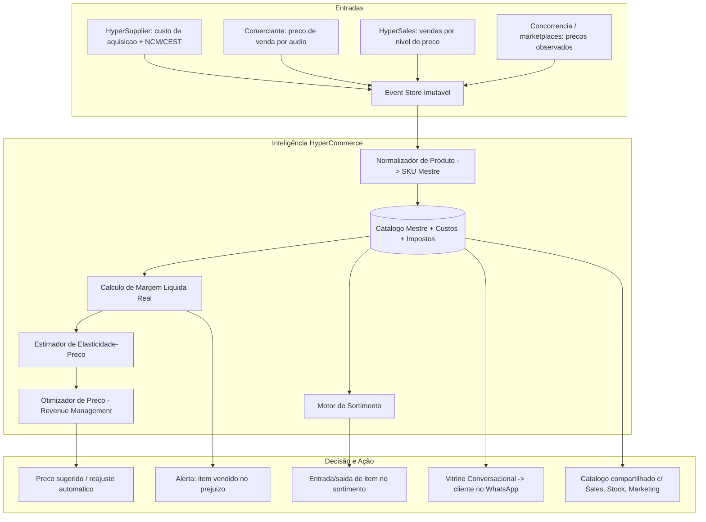
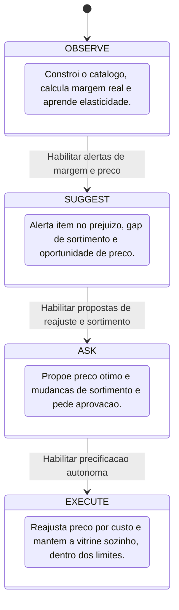

# MyChappie.Digital HyperCommerce — Módulo de Catálogo, Precificação Dinâmica e Vitrine Conversacional

> **Status:** Especificação Arquitetural e Contrato de Módulo
> **Camada:** Inteligência de Merchandising, Pricing, Sortimento e Storefront (Fase 1 / Módulo 0 — núcleo de produto)
> **Ecossistema:** AllasCode / MyChappie.Digital
> **Arquitetura Base:** Event Sourcing, CQRS, Actor Model, Semantics-as-Code, Zero-Trust Auditability

---

## 1. Visão Geral do Módulo

O **HyperCommerce** é o módulo de produto (merchandising) da plataforma MyChappie.Digital: o **catálogo mestre**, a **precificação dinâmica**, a **política de sortimento** e a **vitrine conversacional** que o cliente final acessa pelo WhatsApp. Nas grandes empresas isso é um PIM (Product Information Management) + pricing engine + e-commerce (Salesforce Commerce, VTEX, SAP Retail) com times de compras, precificação e trade.

O micro comerciante **não tem catálogo estruturado nem política de preço**: ele decide o preço "no chute", raramente reajusta, não sabe a margem real de cada item, e não tem vitrine nenhuma além de mostrar a geladeira. O HyperCommerce cria o catálogo automaticamente (a partir dos áudios de compra/venda), calcula a **margem real por produto** (preço − custo de aquisição − impostos − taxa), **recomenda o preço ótimo** por elasticidade e concorrência, e monta uma **vitrine que o cliente navega por conversa** (*"o que você tem de cerveja e quanto tá?"*).

### Pergunta Norteadora de Valor (Critério Mandatório do Sistema)
> **"Qual decisão o usuário consegue tomar melhor depois que este módulo existe?"**
> *O comerciante sabe a margem real de cada produto, qual preço cobrar para maximizar lucro sem perder venda, o que vale a pena ter no sortimento, e passa a ter uma "loja" que o cliente consulta pelo WhatsApp — tudo sem cadastrar produto, montar site ou fazer planilha de precificação.*

---

## 2. Alinhamento com os Critérios Mandatórios da Plataforma

| Critério | Status | Implementação no HyperCommerce |
| :--- | :---: | :--- |
| **Armazena dados do domínio** | **Sim** | Catálogo mestre (SKU, marca, NCM/CEST, embalagem, unidade), preços vigentes e histórico, custos, margens, sortimento por segmento, vitrine, atributos e sinônimos/apelidos. |
| **Produz informação derivada** | **Sim** | Margem líquida real por item, contribuição por categoria, índice de preço vs. concorrência, elasticidade estimada, itens sem giro, gaps de sortimento. |
| **Possui inferência/decisão** | **Sim** | De-para de item do fornecedor para SKU interno, classificação fiscal, decisão de reajuste de preço, entrada/saída de item no sortimento. |
| **Possui IA, otimização ou algoritmo** | **Sim** | NLP de normalização de produto, estimativa de elasticidade-preço, otimização de preço (revenue management), recomendação de sortimento, scraping/estimativa de preço de concorrente. |
| **Produz valor operacional mensurável** | **Sim** | +3% a +12% de margem por precificação correta, eliminação de itens vendidos no prejuízo, sortimento enxuto e mais rentável. |
| **Pode automatizar decisões/ações** | **Sim** | Reajuste automático de preço ao mudar o custo, sugestão/entrada de item novo, atualização da vitrine, alerta de item deficitário. |
| **Pode ser operado pelo WhatsApp** | **Sim** | Preço definido/consultado por áudio, cliente navega a vitrine por conversa, comerciante pergunta "qual minha margem na Coca?". |
| **Capacidade rara/incomum** | **Sim** | Vitrine 100% conversacional (sem app, sem site) e precificação com margem líquida real (pós-imposto e pós-taxa) em tempo real. |
| **Feedback contínuo (Machine Learning)** | **Sim** | Cada venda a cada nível de preço refina a curva de elasticidade e a política de precificação do item. |

---

## 3. Arquitetura de Fatos: do Insumo ao Preço de Vitrine



---

## 4. Funcionalidades de Fundação Obrigatórias (equivalentes a PIM + Pricing enterprise)

### 4.1. Catálogo Mestre Auto-Construído (Product Master / PIM)
- SKU criado automaticamente a partir dos áudios de compra (HyperSupplier) e do inventário inicial (HyperStock).
- Atributos: marca, categoria, embalagem, unidade de medida, volume, NCM/CEST, código de barras (quando lido).
- **Dicionário de sinônimos/apelidos** por comércio e por cliente ("loira", "long neck", "a de sempre").
- Enriquecimento automático (ficha do produto, imagem, categoria) via base pública.

### 4.2. Normalização e De-Para de Item (Item Matching)
- Liga "BRAHMA CHOPP LT 350ML" do cupom do fornecedor ao SKU interno "Brahma 350ml lata".
- Conversão de unidades de compra (caixa/fardo) para unidade de venda.
- Deduplicação de SKU e merge com trilha.

### 4.3. Estrutura de Custo e Margem Líquida Real (Landed Cost & Margin)
- Custo médio móvel por SKU (do HyperSupplier) + frete rateado + impostos de compra.
- Margem líquida real de venda = preço − custo − imposto sobre venda (do HyperAccounting) − taxa de maquininha média (do HyperFinancial).
- Contribuição por item e por categoria.

### 4.4. Gestão de Preços e Listas (Price Management)
- Preço vigente por SKU com histórico datado e motivo de cada alteração.
- Listas de preço por canal (balcão, delivery, carteira/pré-pago, atacadinho).
- Preço promocional com validade e teto de desconto (consumido por HyperMarketing e HyperSales).

### 4.5. Vitrine Conversacional (Conversational Storefront)
- O cliente pergunta e navega: *"o que tem de cerveja?"*, *"tem Red Bull?"*, *"quanto tá a Coca 2L?"*.
- Respostas com disponibilidade real (HyperStock) e preço do canal certo (carteira ganha desconto).
- Cardápio/lista gerado sob demanda em texto ou imagem; nunca um "site" que precisa ser mantido.

### 4.6. Política de Sortimento (Assortment / Range Planning)
- Sortimento base (genérico do segmento "bar") + itens específicos do comércio.
- Curva de participação: quais SKUs sustentam faturamento e margem.
- Candidatos a entrada (gaps) e a saída (sem giro, margem negativa).

### 4.7. Classificação Fiscal do Produto (Tax Classification)
- NCM/CEST e regime (monofásico, ST, integral) por SKU — base para o HyperAccounting segregar tributos.
- Alerta de divergência entre a classificação do cupom e a base oficial.

### 4.8. Kits, Combos e Bundles (Product Bundling)
- Definição de combos ("balde 6 long neck", "cerveja + porção") com preço e margem próprios.
- Explosão automática do combo em itens para baixa de estoque (HyperStock).

### 4.9. Governança de Catálogo entre Comércios (Shared Catalog Backbone)
- Base de produtos compartilhada entre os comércios MyChappie (ficha, NCM, imagem) — cada comércio mantém só seu preço, custo e sortimento.
- Acelera onboarding: novo comerciante já "reconhece" produtos.

### 4.10. Relatórios de Merchandising Sob Demanda (Ad-hoc Reporting)
- *"quais produtos tão me dando prejuízo?"*, *"qual minha margem média em bebida esse mês?"* → texto + gráfico/PDF.

---

## 5. Funcionalidade Preditiva Obrigatória em Destaque

### 🔮 Estimador de Elasticidade-Preço e Previsão de Impacto de Reajuste (`Price-Elasticity & Repricing-Impact Forecaster`)

Modelo **econométrico (regressão de demanda) + bayesiano hierárquico** que estima, por SKU, quanto o volume cai (ou sobe) para cada variação de preço, e projeta o efeito de um reajuste no faturamento e no lucro.

#### O Problema de Mercado que Resolve:
O comerciante tem medo de reajustar preço ("vou perder cliente") e também vende no prejuízo sem saber (o custo subiu e ele não repassou). Não tem como prever o efeito de mudar o preço.

#### Como a Funcionalidade Opera:
1. **Curva de demanda por SKU:** usa o histórico de vendas em diferentes níveis de preço, controlando sazonalidade e promoções (dados do HyperSales).
2. **Pooling entre itens parecidos:** SKUs com pouco histórico "emprestam" informação de categorias semelhantes (hierárquico).
3. **Simulação de reajuste:** para um novo preço, projeta volume, faturamento, margem e receita da categoria, com intervalo de confiança.
4. **Gatilho de custo:** quando o HyperSupplier registra alta de custo, calcula o preço que preserva a margem e o impacto de repassar (ou não).
5. **Alerta de prejuízo:** item cuja margem líquida real ficou negativa → sugere preço mínimo.
6. **Feedback:** cada venda pós-reajuste corrige a elasticidade estimada.

```text
[Exemplo de Notificação ao Comerciante no WhatsApp]
━━━━━━━━━━━━━━━━━━━━━━━━━━━━━━━━━━━━━━━━━━━━━━━━━
🔮 REVISÃO DE PREÇO — 2 ALERTAS
━━━━━━━━━━━━━━━━━━━━━━━━━━━━━━━━━━━━━━━━━━━━━━━━━
Dona Maria:

🔴 Coca-Cola 2L — você vende a R$ 10,00
   Custo subiu p/ R$ 7,90 + imposto + taxa → sua margem
   líquida hoje é R$ 0,42 (quase no prejuízo).
   → Preço sugerido: R$ 11,50. Previsão: -6% no volume,
     +R$ 74/mês de lucro. Bandas: +R$ 40 a +R$ 108.

🟡 Brahma 350ml — a R$ 5,00, margem boa (R$ 1,60)
   Concorrência da região está a R$ 5,50.
   → Espaço para R$ 5,50: previsão -3% volume, +R$ 90/mês.

[✅ Aplicar sugeridos]  [Ajustar]  [Manter]
━━━━━━━━━━━━━━━━━━━━━━━━━━━━━━━━━━━━━━━━━━━━━━━━━
```

---

## 6. Funcionalidade Otimizadora Obrigatória em Destaque

### ⚡ Otimizador de Preço e Sortimento por Lucro Total da Categoria (`Category Profit Optimizer`)

Motor de **otimização não-linear com restrições** que define, para cada categoria, o **conjunto de preços e o sortimento** que maximiza o lucro líquido total — considerando canibalização entre SKUs, papel de cada item (tráfego, margem, imagem), espaço de geladeira e percepção de preço do cliente.

#### O Problema de Mercado que Resolve:
Otimizar preço item a item ignora que baixar a Brahma tira venda da Skol, e que ter preço alto no "item âncora" espanta o cliente da loja inteira. Grandes redes fazem "category management"; o bar não.

#### Como a Funcionalidade Opera:
1. **Papéis de SKU:** âncora/tráfego (preço competitivo, gera visita), margem (onde está o lucro), conveniência, novidade.
2. **Elasticidades cruzadas:** matriz de canibalização estimada dentro da categoria.
3. **Função objetivo:** maximizar `Σ (margem líquida · volume previsto)` da categoria, não do item isolado.
4. **Restrições:** preço do item-âncora ≤ referência da concorrência; espaço de geladeira (HyperStock); teto de variação por reajuste (não assustar o cliente); sortimento entre mín. e máx. de SKUs.
5. **Sortimento junto:** decide qual SKU novo entra e qual sai, pelo ganho marginal de lucro por espaço.
6. **Resultado:** plano de preços + mudanças de sortimento + relatório de ganho estimado.

---

## 7. Conjunto Completo de Funcionalidades para Estar à Frente do Mercado

### 7.1. Predição & Inteligência Futura Adicional
- **Índice de Preço vs. Concorrência (Price Index):** posição do comércio frente à praça por categoria, atualizada com preços observados.
- **Previsão de Repasse de Custo:** antecipa reajustes prováveis da indústria (integra HyperSupplier) e prepara o comerciante.
- **Detecção de "Item Zumbi":** SKU com estoque parado e zero giro há N dias.
- **Previsão de Demanda de Item Novo:** estima venda de um produto que o comércio ainda não tem (com HyperMarketing e PersonalShopper).
- **Simulador de Combo:** projeta aceite e margem de um bundle antes de criar.

### 7.2. Otimização Prescritiva Adicional
- **Otimizador de Preço por Canal:** balcão vs. delivery vs. carteira pré-paga.
- **Otimizador de Preço Psicológico:** arredondamento (R$ 4,99 vs. R$ 5,00) por perfil de clientela.
- **Otimizador de Rebaixa (Markdown):** melhor curva de desconto para escoar item perto do vencimento (com HyperStock).
- **Otimizador de Precificação de Combo:** preço do bundle que maximiza margem incremental.
- **Otimizador de Introdução de Novidade:** preço e volume iniciais de um SKU novo.

### 7.3. Automação de Merchandising, Compliance e Vitrine
- **Reajuste Automático por Custo:** ao subir o custo, aplica (ou sugere) o preço que preserva a margem-alvo.
- **Atualização Automática da Vitrine:** disponibilidade e preço sempre sincronizados com HyperStock/HyperFinancial.
- **Validação Fiscal do SKU:** NCM/CEST conferidos na base oficial; bloqueia venda de item mal classificado só se afetar tributo.
- **Publicação de Catálogo Compartilhado:** contribui fichas para a base comum (sem expor preço/custo).
- **Guardião de Margem:** impede preço abaixo do custo sem override registrado.

### 7.4. Auditoria Imutável e Trilha de Prova (Zero-Trust Provenance)
- Toda alteração de preço audita até o evento que a motivou (custo novo, decisão do comerciante, otimização, promoção).
- Histórico de preço imutável e datado; nunca sobrescrito.
- Margem sempre reconstruível a partir de custo + impostos + taxa vigentes na data.
- Preços e custos em centavos inteiros (`BigInt`).

---

## 8. Modos de Autonomia do Módulo



- **Modo 1: `OBSERVE`** — só monta o catálogo e calcula margem; responde consultas.
- **Modo 2: `SUGGEST`** — alertas de prejuízo, de sortimento e de oportunidade de preço.
- **Modo 3: `ASK`** — plano de preços e sortimento otimizado para aprovação de 1 toque.
- **Modo 4: `EXECUTE`** — reajuste automático quando o custo muda (mantendo a margem-alvo) e vitrine sempre atualizada, dentro do teto de variação configurado.

---

## 9. Demonstração Prática: Experiência do Usuário via WhatsApp

### Exemplo 1: Definição de Preço por Áudio
> **Dona Maria (áudio):** *"A cachaça artesanal nova vende a 12 a dose."*
> **MyChappie HyperCommerce:** *"Anotado: Cachaça Artesanal — R$ 12,00/dose. Custo por dose ~R$ 4,80, imposto R$ 0,60 → margem líquida R$ 6,60 (55%). Ótima margem. Adicionei à sua vitrine na categoria 'Destilados'."*

### Exemplo 2: Cliente Navegando a Vitrine
> **Cliente (áudio para o bar):** *"O que você tem de cerveja gelada e quanto tá?"*
> **MyChappie HyperCommerce:** *"Geladas agora: Brahma 350ml R$ 5,00 · Skol lata R$ 4,80 · Heineken long neck R$ 9,00 · Original 600ml R$ 12,00. (Se você tiver carteira aqui, ganha 12% em tudo.)"*

### Exemplo 3: Alerta de Prejuízo + Reajuste Autônomo
> **MyChappie HyperCommerce (modo EXECUTE):**
> *"⚠️ O custo da Coca 2L subiu para R$ 7,90 na última compra. Sua margem líquida a R$ 10,00 caiu para R$ 0,42. Reajustei automaticamente para R$ 11,50 (dentro do seu limite de +15%). Previsão: -6% no volume, +R$ 74/mês de lucro. Vitrine atualizada."*

---

## 10. Contrato de Governança Semântica e Eventos (`AGENTS.md`)

### Identidades Semânticas
- **Actor:** `CommerceAgent`
- **Contexto Semântico:** `Commerce.CatalogPricingAndAssortment`
- **Papel:** Manter o catálogo mestre, calcular margem líquida real, otimizar preço e sortimento por lucro de categoria e servir a vitrine conversacional.

### Eventos Consumidos (Listen)
- `Purchase.price.recorded` / `Supplier.master.updated` (HyperSupplier — custo e ficha)
- `Sale.confirmed` (HyperSales — venda por nível de preço)
- `Accounting.tax.classification.updated` (HyperAccounting — regime tributário do SKU)
- `Finance.fees.updated` (HyperFinancial — taxa média da maquininha)
- `Stock.balance.updated` / `Stock.expiry.forecasted` (HyperStock — disponibilidade e rebaixa)
- `Market.competitor.price.observed` (coleta externa — preço de concorrente)

### Eventos Emitidos (Emit)
- `Catalog.product.created` / `Catalog.product.updated`
- `Catalog.price.changed` (com motivo e valor anterior)
- `Catalog.margin.updated`
- `Catalog.assortment.changed` (entrada/saída de SKU)
- `Catalog.elasticity.estimated`
- `Catalog.loss.flagged` (item com margem líquida negativa)
- `Storefront.query.answered` (consulta de vitrine do cliente)

### Invariantes Obrigatórios do Módulo
1. **Guardião de Margem:** nenhum preço é publicado abaixo do custo líquido sem override explícito e registrado.
2. **Histórico de Preço Imutável:** toda alteração é datada, motivada e reconstruível; nunca sobrescrita.
3. **SKU Único:** um produto físico corresponde a exatamente um SKU mestre; merges são auditáveis e reversíveis.
4. **Coerência de Margem:** margem líquida = preço − custo − imposto − taxa, sempre com os parâmetros vigentes na data da venda.
5. **Vitrine = Realidade:** a vitrine só oferta item com disponibilidade real (HyperStock) e preço do canal correto.
6. **Teto de Variação Autônoma:** reajuste automático respeita o limite percentual configurado pelo comerciante.
7. **Precisão Monetária Sem Perda de Fração:** centavos inteiros (`BigInt`).

---

## 11. Diferenciais Competitivos: HyperCommerce vs. Concorrentes

| Capacidade | PIM + Pricing Enterprise (VTEX, SAP Retail, Nielsen) | Cadastro de produto de ERP simples | MyChappie HyperCommerce |
| :--- | :---: | :---: | :---: |
| **Criação de catálogo** | Importação/digitação | Manual, campo a campo | **Automática pelos áudios de compra/venda** |
| **Margem** | Bruta, planilha | Bruta simples | **Líquida real (pós-imposto e pós-taxa), em tempo real** |
| **Precificação** | Regra ou consultoria de pricing | "No chute" | **Elasticidade estimada + otimização por lucro de categoria** |
| **Concorrência** | Painéis pagos | Não acompanha | **Índice de preço com coleta contínua** |
| **Vitrine** | E-commerce a manter | Inexistente | **Conversacional no WhatsApp, sempre sincronizada** |
| **Sortimento** | Category management | Intuição | **Otimizado por lucro/espaço, com gaps e itens zumbi** |
| **Reajuste por custo** | Manual/lote | Manual | **Automático preservando a margem-alvo** |
| **Interface** | Desktop/web | Tela de cadastro | **WhatsApp nativo (áudio, texto)** |

---

## 12. Conclusão e Roadmap de Implementação

O **HyperCommerce** é o núcleo de produto do MyChappie: o catálogo, o preço e a vitrine que todos os outros módulos consomem. Ele dá ao pequeno comerciante o que só grandes varejistas têm — gestão de margem líquida, precificação por elasticidade, category management e uma loja digital — sem cadastrar nada, sem planilha e sem site. Alimenta o HyperSales (preço/itens), o HyperStock (SKU/embalagem), o HyperMarketing (margem/complementares), o HyperAccounting (classificação fiscal) e o HyperFinancial (contribuição por item), e conecta o cliente final à oferta pela conversa.

### Roadmap
1. **Fase 1a:** catálogo mestre auto-construído, de-para de item, custo/margem líquida real, dicionário de apelidos.
2. **Fase 1b:** gestão de preços com histórico, vitrine conversacional, alertas de prejuízo e de sortimento (SUGGEST).
3. **Fase 1c:** estimador de elasticidade, otimizador de preço/sortimento por categoria, reajuste automático por custo (ASK → EXECUTE).
4. **Fase 2:** índice de preço de concorrência em escala, catálogo compartilhado entre comércios, precificação por canal, otimização de markdown e combos.
